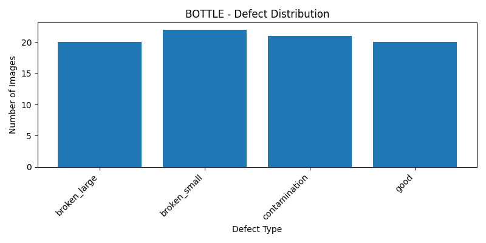
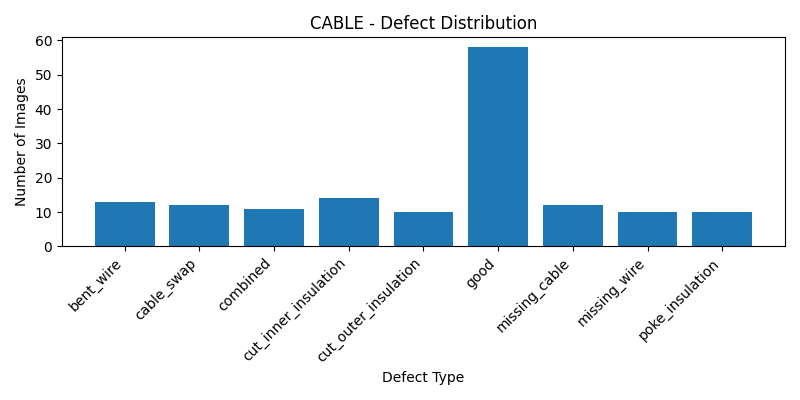

# VisionInspectAI

## Overview
This repository contains the initial data exploration and preprocessing pipeline for the VisionInspectAI project.

## Project Structure

```
VisionInspectAI/
│
├── dataset/
├── output_charts/
│   ├── Bottle.png
│   ├── Cable.png
│   ├── Capsule.png
│   ├── ...
│   └── Zipper.png
│
├── src/
│   ├── utils.py
│   ├── dataset_info.py
│   ├── statistics.py
│   ├── preprocessing.py
│   ├── visualization.py
│   ├── eda.py
│   └── notebooks/
│
├── main.py
├── README.md
├── requirements.txt
├── .gitignore
└── LICENSE
``` 

## Requirements

- Python 3.10+
- OpenCV
- NumPy
- Matplotlib

Install dependencies:

```bash
pip install -r requirements.txt
```

## Run

```bash
python main.py
```

## Week 1 & Week 2 Progress
### Completed
- Dataset exploration for all 15MVTec AD Categories
- Image preprocessing {resize, normalization, RGB conversion}
- Dataset Summary statistics.
- Defect-wise image count for every category.
- Display of sample images and ground truth masks
- Visualization of defect distributions using bar charts
- Original and processed image inspection.

### Results
- Categories processed: 15
- Dataset summary generated successfully
- Defect statistics generated for all categories
- Defect percentages distribution calculated for all categories.
- Preprocessing validated for all categories.
- EDA visualizations generated successfully.

## Dataset Coverage

| Metric | Value |
|--------|------:|
| Categories | 15 |
| Train Images | 3,769 |
| Test Images | 1,807 |
| Ground Truth Masks | 1,260 |

## Sample Output

```text
Category : BOTTLE
- Train Images : 209
- Test Images : 83
- Ground Truth : 63

Defect Statistics
broken_large : 20
broken_small : 22
contamination : 21
good : 20

Processed Image
Shape : (256, 256, 3)
Dtype : float32
Min   : 0.1137
Max   : 1.0000
```
Similar statistics and visualizatiobs are automatically generated for all 15MVTec AD Categories.

## Sample Visualizations
 Example defect distribution generated during EDA:
 
 

**Note:** 
This README documents the current progress on this branch and may be updated as the project evolves
