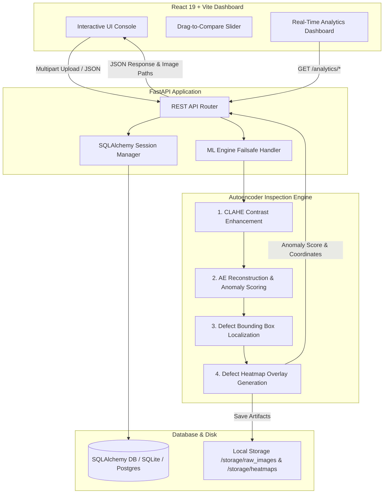

# 🔍 Visual AI Quality Inspection & Defect Detection System

An enterprise-grade, automated visual inspection platform engineered for real-time defect detection and quality assurance on industrial assembly lines. Leveraging FastAPI, SQLAlchemy, and React 19, the system processes high-resolution target scans using an Autoencoder (AE) Reconstruction Engine to pinpoint structural anomalies, compute exact severity metrics, render defect heatmaps, and generate production-line certificates.

---

## 🏗️ System Architecture



---

## 📂 Repository Directory Structure

```text
VisionInspectAI/
├── .vscode/
├── Documentation/
├── backend/
│   ├── app/
│   ├── tests/
│   └── main.py
├── frontend/
│   ├── src/
│   └── public/
├── .dockerignore
├── .gitignore
├── LICENSE
├── README.md
├── docker-compose.yml
├── generate_docs.py
├── owner.txt
├── package-lock.json
├── package.json
├── terminal.txt
└── test_e2e.py
```

---

## 🛠️ Tech Stack

**Backend**
* **Framework:** FastAPI (Python 3.10+)
* **Database & ORM:** SQLAlchemy (SQLite / PostgreSQL)
* **Computer Vision & ML:** OpenCV, Pillow, PyTorch / TensorFlow (Autoencoder Engine)
* **ASGI Server:** Uvicorn

**Frontend**
* **Framework:** React 19 + Vite
* **Styling:** Tailwind CSS v4
* **UI & Animation:** Framer Motion, Lucide React
* **Data Visualization:** Recharts
* **HTTP Client:** Axios

**DevOps & Testing**
* **Containerization:** Docker & Docker Compose
* **End-to-End Testing:** `test_e2e.py`

---

## 📂 Database Schema

### `users`
| Column | Type | Constraints / Description |
| :--- | :--- | :--- |
| `id` | Integer | Primary Key, Auto-increment |
| `username` | String | Unique, Indexed |
| `email` | String | Unique, Indexed |
| `hashed_password` | String | Encrypted password string |
| `role` | Enum(UserRole) | ADMIN, OPERATOR, INSPECTOR |
| `is_active` | Boolean | User status flag (Default: True) |
| `created_at` | DateTime | UTC Timestamp |

### `products`
| Column | Type | Constraints / Description |
| :--- | :--- | :--- |
| `id` | Integer | Primary Key, Auto-increment |
| `sku` | String | Unique product identifier (e.g., `MVI-PROD-2026`) |
| `name` | String | Product label |
| `category` | String | Component classification (e.g., `GRID`) |
| `created_at` | DateTime | UTC Timestamp |

### `inspection_records`
| Column | Type | Constraints / Description |
| :--- | :--- | :--- |
| `id` | Integer | Primary Key, Auto-increment |
| `inspection_id` | String | Unique run identifier (e.g., `INS-20260815_190000`) |
| `product_id` | Integer | Foreign Key (`products.id`) |
| `product_sku` | String | Target SKU code |
| `raw_image_path` | String | Storage path to raw target frame |
| `heatmap_image_path` | String | Storage path to generated AI heatmap |
| `pass_fail_decision` | String | System verdict (`PASS`, `FAIL`) |
| `is_defective` | Boolean | Defect detection flag |
| `defect_type` | String | Identified anomaly (e.g., `Missing Component`) |
| `severity_level` | Enum(SeverityLevel) | `NONE`, `LOW`, `MEDIUM`, `HIGH`, `CRITICAL` |
| `overall_severity_score` | Float | Measured anomaly reconstruction metric |
| `confidence_score` | Float | Model confidence percentage |
| `latency_ms` | Float | Complete inference time in milliseconds |
| `created_at` | DateTime | UTC Timestamp |

---

## 📡 API Endpoints Summary

### Inspection & Operations
| Method | Endpoint | Description |
| :--- | :--- | :--- |
| `POST` | `/inspect` | Accepts a single frame for AE analysis, generates heatmap overlays, and persists inspection metadata. |
| `POST` | `/batch-inspect` | Batch process multi-file inspection runs. |
| `GET` | `/inspections` | Paginated retrieval of historical inspection records. |
| `GET` | `/inspections/{inspection_id}` | Retrieves complete execution record by inspection ID. |
| `GET` | `/products` | Fetches registered product SKUs and categories. |

### Executive Analytics
| Method | Endpoint | Description |
| :--- | :--- | :--- |
| `GET` | `/analytics/summary` | Returns total counts, overall pass/fail rates, average confidence, and latency. |
| `GET` | `/analytics/defect-trends` | Returns day-by-day pass, fail, and defect totals for the last 30 days. |
| `GET` | `/analytics/severity-distribution` | Categorical inspection volume across severity tiers. |
| `GET` | `/analytics/defect-types` | Frequency breakdown categorized by defect type. |
| `GET` | `/analytics/recent-inspections` | Latest detailed execution logs. |

---

## ⚡ Quick Start & Setup

### Option 1: Docker Compose (Recommended)

Run the full stack (Frontend, Backend, and Database) with a single command:

```bash
docker-compose up --build
```

* **Operator Console Dashboard:** `http://localhost:5173`
* **API Interactive Documentation (Swagger UI):** `http://localhost:8000/docs`

---

### Option 2: Local Development Setup

#### Prerequisites
* **Python:** 3.10+
* **Node.js:** v18+

#### 1. Backend Setup
```bash
cd backend
python -m venv venv
source venv/bin/activate  # On Windows: venv\Scripts\activate
pip install -r requirements.txt
uvicorn main:app --reload
```

#### 2. Frontend Setup
```bash
cd frontend
npm install
npm run dev
```

---

## 🧪 Testing & Utilities

**End-to-End Testing**
Run the end-to-end test suite to verify pipeline integrity:
```bash
python test_e2e.py
```
