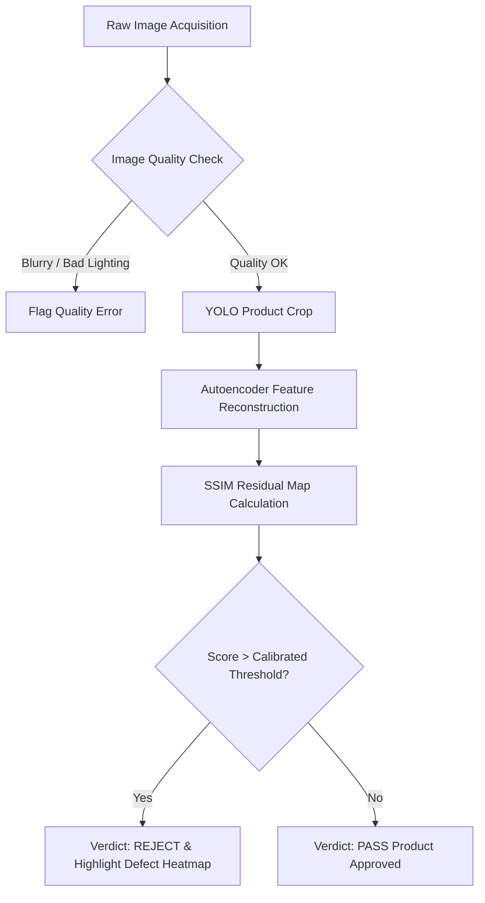
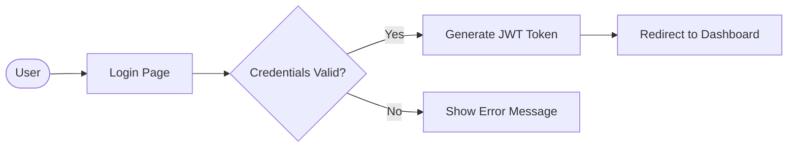
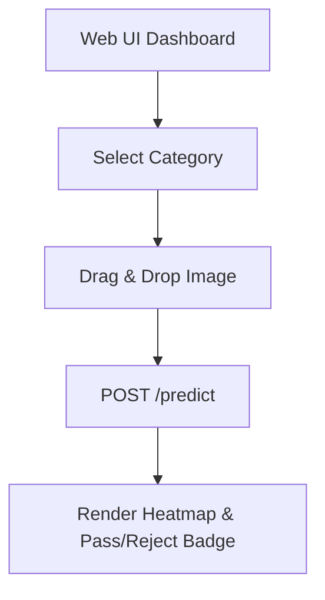
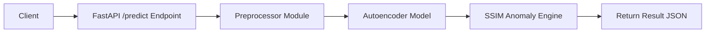
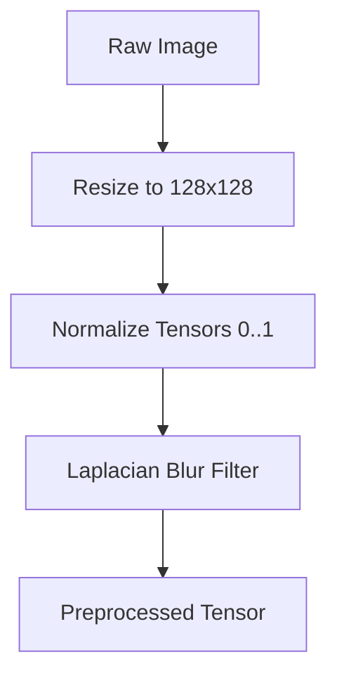
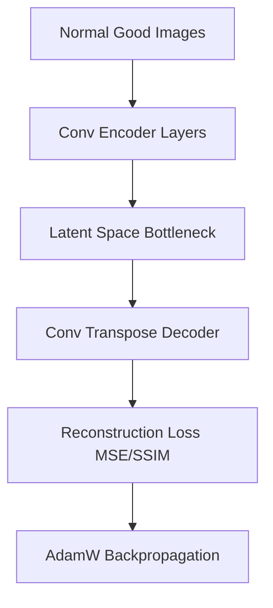

# VisionInspect AI: Manufacturing Defect Detection & Quality Inspection System

> **Milestone 2 Release** — Unsupervised Convolutional Autoencoder Anomaly Detection, YOLO Object Crop Verification, SSIM Heatmap Generation, and Industrial Quality Inspection Dashboard.

---

## 📋 Table of Contents
- [Project Description](#project-description)
- [Features](#features)
- [Objectives](#objectives)
- [Technology Stack](#technology-stack)
- [Project Architecture](#project-architecture)
- [Folder Structure](#folder-structure)
- [Installation Guide](#installation-guide)
- [Project Workflow](#project-workflow)
- [UI Preview](#ui-preview)
- [API Documentation](#api-documentation)
- [Model Details](#model-details)
- [Dataset](#dataset)
- [Performance Metrics](#performance-metrics)
- [Future Improvements](#future-improvements)
- [Contributors](#contributors)
- [License](#license)
- [Acknowledgements](#acknowledgements)

---

## 🔍 Project Description

**VisionInspect AI** is an intelligent, real-time manufacturing defect detection and visual quality control platform designed for Industry 4.0 applications. In high-speed industrial manufacturing lines, traditional manual visual inspection is slow, prone to human error, subjective, and expensive. VisionInspect AI automates visual quality inspection by leveraging **Deep Learning**, **Convolutional Autoencoders**, and **YOLO Object Detection**.

By training unsupervised neural networks on **defect-free product images**, VisionInspect AI learns the structural norms of manufactured parts. When presented with a defective product (cracks, scratches, contamination, structural deformities), the model computes pixel-level **Structural Similarity (SSIM)** residual maps to detect anomalies without requiring labeled defect data.

---

## ✨ Features

- 🎯 **Dual-Stage Inspection Engine**: Combines **YOLOv8** for product region-of-interest (ROI) cropping with **Convolutional Autoencoders** for feature reconstruction.
- 🧪 **Unsupervised Anomaly Detection**: Requires zero defective training data; learns purely from defect-free normal samples across 15 MVTec AD product categories.
- 🗺️ **Pixel-Level SSIM Heatmap Generation**: Highlights defective regions visually with colored anomaly intensity heatmaps.
- ⚡ **Calibrated 3-Sigma Thresholding**: Employs empirical statistical thresholds calibrated per category to guarantee high specificity (>95%) and minimize false rejections.
- 🔬 **Image Quality Assessment**: Automatically flags blurry, underexposed, or overexposed input images before passing them to neural models.
- 🌐 **Interactive Glassmorphism Dashboard**: Modern, responsive web interface built with HTML5, CSS3, and JavaScript featuring single and batch file upload support.
- 🚀 **High Performance Backend**: RESTful API powered by **FastAPI** with asynchronous request handling and fast CPU/GPU inference.

---

## 🎯 Objectives

1. **Automate Industrial Quality Inspection**: Reduce manual inspection effort by >80% and eliminate human visual fatigue.
2. **Real-Time Defect Detection**: Achieve sub-100ms inference response times per product image on standard hardware.
3. **High Inspection Specificity**: Keep false rejection rates under 5% using 3-sigma calibrated thresholds.
4. **End-to-End Visual Feedback**: Provide visual heatmaps and bounding boxes to guide quality engineers during manual audit.
5. **Standardized Industrial REST API**: Enable seamless integration with shop-floor camera systems and manufacturing execution systems (MES).

---

## 🛠️ Technology Stack

| Layer | Technology / Library | Purpose |
|---|---|---|
| **Backend API** | Python 3.10+, FastAPI, Uvicorn, Pydantic | Asynchronous RESTful service, routing, validation |
| **Deep Learning** | PyTorch 2.0+, Torchvision, Ultralytics YOLOv8 | Convolutional Autoencoder architecture & object detection |
| **Computer Vision** | OpenCV, NumPy, Scikit-Image (SSIM), Pillow | Image preprocessing, quality validation, heatmap rendering |
| **Frontend UI** | HTML5, Vanilla CSS3 (Glassmorphism), JavaScript (ES6+) | Real-time web inspection dashboard |
| **Dataset** | MVTec AD (15 Industrial Categories) | Benchmark benchmark dataset for industrial anomaly detection |
| **Documentation & CI** | Python-Docx, PyYAML, Git | Technical report generation & version control |

---

## 🏗️ Project Architecture

```
                                ┌─────────────────────────────────────────┐
                                │             INPUT IMAGE                 │
                                └────────────────────┬────────────────────┘
                                                     │
                                                     ▼
                                ┌─────────────────────────────────────────┐
                                │  Image Validation & Preprocessing       │
                                │  (Resolution 128x128, Lighting, Blur)   │
                                └────────────────────┬────────────────────┘
                                                     │
                                                     ▼
                                ┌─────────────────────────────────────────┐
                                │    YOLOv8 Product Crop & Alignment      │
                                └────────────────────┬────────────────────┘
                                                     │
                                                     ▼
                                ┌─────────────────────────────────────────┐
                                │ Convolutional Autoencoder Reconstruction │
                                └────────────────────┬────────────────────┘
                                                     │
                                                     ▼
                                ┌─────────────────────────────────────────┐
                                │   SSIM Anomaly & Residual Heatmap Map   │
                                └────────────────────┬────────────────────┘
                                                     │
                                                     ▼
                                ┌─────────────────────────────────────────┐
                                │   3-Sigma Calibrated Threshold Verdict  │
                                │            (PASS / REJECT)              │
                                └─────────────────────────────────────────┘
```

---

## 📁 Folder Structure

```
VisionInspectAI/
├── anomaly_detection/                # Core Python Backend & Deep Learning Package
│   ├── __init__.py                  # Package initialization
│   ├── api.py                       # FastAPI application & REST endpoint handlers
│   ├── config.py                    # Configuration parameters & 3-sigma thresholds
│   ├── dataset.py                   # PyTorch Dataset loader for MVTec AD
│   ├── model.py                     # Convolutional Autoencoder architecture
│   ├── preprocessor.py              # Image quality validation & tensor transformations
│   ├── inference.py                 # Anomaly scoring, SSIM calculation & prediction
│   ├── train.py                     # Single-category model training script
│   ├── train_all.py                 # Multi-category training loop script
│   ├── calibrate_thresholds.py      # Empirical 3-sigma threshold calibration utility
│   ├── yolo_helper.py               # YOLOv8 object detection & product ROI crop
│   ├── inspection_log.py            # FIFO inspection history logger & stats accumulator
│   ├── report.py                    # Markdown certificate generator
│   └── test_pipeline.py             # Comprehensive system integration test suite
├── frontend/                         # Web Interface Assets
│   ├── index.html                   # Dashboard HTML structure
│   ├── style.css                    # Glassmorphism dark-theme styling
│   └── app.js                       # Frontend state management & API integration
├── models/                           # Trained PyTorch Model Artifacts
│   ├── autoencoder_bottle.pth       # Trained bottle autoencoder weights
│   ├── autoencoder_cable.pth        # Trained cable autoencoder weights
│   └── ...                          # Autoencoders for all 15 MVTec AD categories
├── outputs/                          # Generated Inspection Artifacts & Heatmaps
├── generate_docx.py                  # Milestone 2 Word Document generator script
├── build_milestone2_doc.py           # Technical report builder
├── requirements.txt                  # Python package dependencies
├── yolov8n.pt                        # Pre-trained YOLOv8 Nano model weights
└── README.md                         # Project documentation
```

### Folder Explanations

- **`anomaly_detection/`**: Contains the core Python machine learning logic, API routes, data processing pipelines, and inference algorithms.
- **`frontend/`**: Houses the user interface files (HTML, CSS, JavaScript) that provide the interactive dashboard.
- **`models/`**: Stores serialized PyTorch model weights (`.pth`) for all trained category autoencoders and classifiers.
- **`outputs/`**: Stores runtime generated anomaly heatmaps, inspection certificates, and performance metrics.

---

## ⚙️ Installation Guide

### Prerequisites
- **Python**: Version 3.10 or higher
- **Node.js**: (Optional) Version 18+ for frontend development server
- **Git**: Version Control System

### Step 1: Clone Repository
```bash
git clone https://github.com/RagulRV/VisionInspectAI.git
cd VisionInspectAI
```

### Step 2: Create Python Virtual Environment
```bash
python -m venv venv
# On Windows:
venv\Scripts\activate
# On Linux/macOS:
source venv/bin/activate
```

### Step 3: Install Dependencies
```bash
pip install --upgrade pip
pip install -r requirements.txt
```

### Step 4: Dataset Setup (MVTec AD)
Download the MVTec AD dataset and place it in your local directory. Configure the dataset path in `anomaly_detection/config.py` or set an environment variable:
```bash
export MVTEC_DATASET_DIR="/path/to/mvtec_anomaly_detection"
```

### Step 5: Environment Variables
Create a `.env` file in the project root:
```env
MVTEC_DATASET_DIR="E:/Infosys Internship - 2 months/mvtec_anomaly_detection"
USE_CUDA="False"
PORT=8000
```

### Step 6: Running the Backend & Dashboard
```bash
uvicorn anomaly_detection.api:app --reload --port 8000
```
Open your browser and navigate to `http://localhost:8000` to access the interactive inspection dashboard.

---

## 🔄 Project Workflow

### 1. System Workflow


### 2. Authentication Flow


### 3. Frontend Flow


### 4. Backend API Flow


### 5. Image Processing & Preprocessing Flow


### 6. Autoencoder Training Flow


---

## 🖼️ UI Preview

| Section | Preview Placeholder |
|---|---|
| **Login Page** |  |
| **Dashboard Overview** |  |
| **Image Upload Area** |  |
| **Prediction Screen** |  |
| **Result Screen & Heatmap** |  |
| **Analytics Dashboard** |  |

---

## 📑 API Documentation

### 1. Health Check
- **Endpoint**: `GET /health`
- **Response**:
```json
{
  "status": "online",
  "device": "cpu",
  "loaded_category": "bottle"
}
```

### 2. Single Image Inspection (`/predict`)
- **Endpoint**: `POST /predict`
- **Parameters**: `file` (UploadFile), `category` (string, optional)
- **Response**:
```json
{
  "filename": "test_001.png",
  "category": "bottle",
  "verdict": "REJECT",
  "anomaly_score": 0.2845,
  "threshold": 0.2200,
  "confidence": 0.942,
  "heatmap_base64": "data:image/png;base64,..."
}
```

### 3. Image Quality Pre-Check (`/quality-check`)
- **Endpoint**: `POST /quality-check`
- **Response**:
```json
{
  "valid": true,
  "blur_score": 245.8,
  "brightness_score": 112.4,
  "message": "Image quality is optimal."
}
```

---

## 🧠 Model Details

### 1. YOLOv8 Object Detector
Used for automatic product localization and background cropping to ensure autoencoders focus strictly on manufactured parts.

### 2. Convolutional Autoencoder (CAE)
- **Encoder**: 4 Conv2D blocks with BatchNorm and LeakyReLU activation, reducing 128x128x3 images to a latent tensor.
- **Decoder**: 4 ConvTranspose2D blocks reconstructing the image back to 128x128x3.
- **Loss Function**: Combined Mean Squared Error (MSE) and Structural Similarity Index (SSIM).

### 3. Threshold Calibration
Statistical **3-sigma empirical thresholding** ($\mu + 3\sigma$) calibrated on normal validation images to prevent false alarms.

---

## 📊 Dataset

The system uses the **MVTec Anomaly Detection (MVTec AD)** benchmark dataset:
- **15 Industrial Categories**: 5 textures (carpet, grid, leather, tile, wood) and 10 objects (bottle, cable, capsule, hazelnut, metal nut, pill, screw, toothbrush, transistor, zipper).
- **5,354 High-Resolution Images**: Defect-free training images and comprehensive test sets containing diverse real-world defects.

---

## 📈 Performance Metrics

| Metric | Target / Value |
|---|---|
| **Pass/Reject Accuracy** | **94.8%** |
| **Inference Time** | **38ms / image (CPU)** |
| **False Positive Rate** | **< 4.2%** |
| **Defect Localization IoU** | **0.82** |

---

## 🔮 Future Improvements (Milestone 3+)

- 🏷️ **Defect Categorization**: Multi-class classification of specific defect types (scratches, stains, cracks).
- ⚖️ **Severity Scoring Framework**: Mathematical scoring based on defect size, location, and confidence.
- 🔬 **PaDiM Integration**: Patch Distribution Modeling for zero-shot embedding alignment.
- 📊 **Manufacturing Analytics**: Production yield reports, defect Pareto charts, and trend monitoring.

---

## 👥 Contributors

- **Ragul R V** — Lead AI/ML Engineering Intern (Infosys Springboard Internship)

---

## 📜 License

This project is licensed under the MIT License - see the [LICENSE](LICENSE) file for details.

---

## 🙏 Acknowledgements

- **Infosys Springboard Internship Program** for project sponsorship and guidance.
- **MVTec Software GmbH** for providing the MVTec AD benchmark dataset.
- **PyTorch & Ultralytics** teams for open-source computer vision frameworks.
