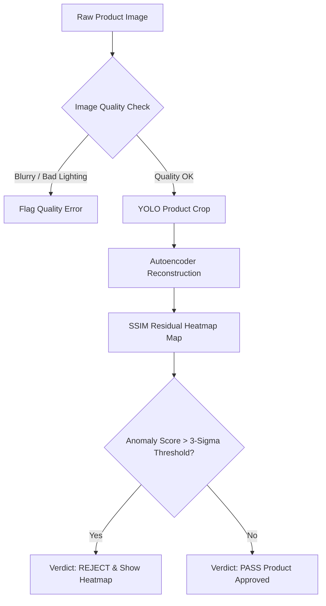

# VisionInspect AI: Manufacturing Defect Detection & Quality Inspection System

> **Milestone 2 Official Release** — Unsupervised Convolutional Autoencoder Anomaly Detection, YOLO Object Crop Verification, SSIM Residual Heatmap Generation, and Interactive Quality Inspection Dashboard.

---

## 📋 Table of Contents
- [Project Overview](#project-overview)
- [Objectives](#objectives)
- [Features](#features)
- [Installation](#installation)
- [Project Structure](#project-structure)
- [Dataset](#dataset)
- [Autoencoder](#autoencoder)
- [YOLO](#yolo)
- [Image Processing](#image-processing)
- [Defect Detection](#defect-detection)
- [APIs](#apis)
- [UI](#ui)
- [Screenshots Placeholder](#screenshots-placeholder)
- [Flowcharts](#flowcharts)
- [Future Scope](#future-scope)

---

## 🔍 Project Overview

**VisionInspect AI** is an intelligent, real-time manufacturing defect detection and visual quality control platform built for Industry 4.0 applications. In high-speed manufacturing environments, traditional manual inspection is labor-intensive, slow, subjective, and prone to visual fatigue.

VisionInspect AI automates visual quality control by leveraging **Deep Learning**, **Convolutional Autoencoders**, and **YOLO Object Detection**. By training unsupervised neural networks exclusively on **defect-free (normal) product images**, VisionInspect AI learns the structural norms of manufactured parts across 15 industrial product categories. When presented with a defective product (scratches, cracks, contamination, deformities), the system computes **Structural Similarity (SSIM)** residual maps to detect and localize anomalies without requiring labeled defective training data.

---

## 🎯 Objectives

1. **Automate Quality Inspection**: Reduce manual inspection effort by >80% and eliminate human visual fatigue.
2. **Real-Time Defect Detection**: Achieve sub-100ms inference response times per product image on standard CPU hardware.
3. **High Inspection Specificity**: Keep false rejection rates under 5% using category-specific 3-sigma calibrated thresholds.
4. **Visual Defect Localization**: Provide pixel-wise residual heatmaps and bounding boxes to assist quality engineers during manual audit.
5. **Standardized Industrial API**: Expose RESTful FastAPI endpoints for seamless integration with production line camera systems.

---

## ✨ Features

- 🎯 **Dual-Stage Inspection Architecture**: Combines **YOLOv8** for product region-of-interest (ROI) cropping with **Convolutional Autoencoders** for spatial reconstruction.
- 🧪 **Unsupervised Anomaly Detection**: Requires zero defective training samples; trained purely on normal good images across 15 MVTec AD categories.
- 🗺️ **SSIM Residual Heatmaps**: Generates color-coded pixel-wise anomaly heatmaps highlighting defective regions.
- ⚡ **Calibrated 3-Sigma Thresholding**: Applies statistical thresholds ($\mu + 3\sigma$) calibrated per category to guarantee high specificity.
- 🔬 **Image Quality Assessment**: Automatically flags blurry, underexposed, or overexposed input images before neural inference.
- 🌐 **Interactive Web Dashboard**: Responsive glassmorphism web interface supporting drag-and-drop single and batch image inspection.

---

## ⚙️ Installation

### Prerequisites
- **Python**: 3.10 or higher
- **Git**: Version control system

### Step 1: Clone Repository
```bash
git clone https://github.com/GKSJ-Deepvision/VisionInspectAI.git
cd VisionInspectAI
```

### Step 2: Create & Activate Virtual Environment
```bash
python -m venv venv
# Windows:
venv\Scripts\activate
# Linux/macOS:
source venv/bin/activate
```

### Step 3: Install Dependencies
```bash
pip install --upgrade pip
pip install -r requirements.txt
```

### Step 4: Dataset Setup (MVTec AD)
Download the MVTec AD dataset and place it in your local directory. Configure the dataset directory path in `anomaly_detection/config.py` or set an environment variable:
```bash
export MVTEC_DATASET_DIR="/path/to/mvtec_anomaly_detection"
```

### Step 5: Run Backend API & Inspection Dashboard
```bash
uvicorn anomaly_detection.api:app --reload --port 8000
```
Open your browser and navigate to `http://localhost:8000` to access the inspection dashboard.

---

## 📁 Project Structure

```
VisionInspectAI/
├── anomaly_detection/                # Core Python Backend & Deep Learning Module
│   ├── __init__.py                  # Package initialization
│   ├── api.py                       # FastAPI application & REST endpoints
│   ├── config.py                    # Configurations & 3-sigma thresholds
│   ├── dataset.py                   # PyTorch Dataset loader for MVTec AD
│   ├── model.py                     # Convolutional Autoencoder architecture
│   ├── preprocessor.py              # Image quality validation & normalization
│   ├── inference.py                 # SSIM anomaly scoring & prediction engine
│   ├── train.py                     # Autoencoder model training script
│   ├── train_all.py                 # Multi-category training loop
│   ├── calibrate_thresholds.py      # Statistical threshold calibration utility
│   ├── yolo_helper.py               # YOLOv8 product ROI cropping wrapper
│   ├── inspection_log.py            # Inspection logging & statistics manager
│   ├── report.py                    # Inspection report generator
│   └── test_pipeline.py             # System verification test suite
├── frontend/                         # Web Interface Dashboard
│   ├── index.html                   # Dashboard HTML structure
│   ├── style.css                    # Glassmorphism dark-theme styling
│   └── app.js                       # Frontend interaction & API client
├── models/                           # Trained PyTorch Model Weights (.pth)
│   ├── autoencoder_bottle.pth       # Trained bottle autoencoder weights
│   ├── autoencoder_cable.pth        # Trained cable autoencoder weights
│   └── ...                          # Trained autoencoders for 15 categories
├── generate_docx.py                  # Milestone 2 Word Document generator script
├── Milestone_2_Documentation.docx    # Milestone 2 Academic Documentation Report
├── requirements.txt                  # Python dependencies
├── yolov8n.pt                        # Pre-trained YOLOv8 Nano model weights
└── README.md                         # Project documentation
```

---

## 📊 Dataset

The system is evaluated on the benchmark **MVTec Anomaly Detection (MVTec AD)** dataset:
- **15 Industrial Categories**: 5 textures (*carpet, grid, leather, tile, wood*) and 10 objects (*bottle, cable, capsule, hazelnut, metal nut, pill, screw, toothbrush, transistor, zipper*).
- **5,354 High-Resolution Images**: Defect-free training split and comprehensive test split containing diverse real-world manufacturing flaws (cracks, scratches, contamination, missing components).

---

## 🧠 Autoencoder Architecture

The core anomaly detection engine relies on a **Convolutional Autoencoder (CAE)**:
- **Encoder**: 4 Conv2D blocks with BatchNorm and LeakyReLU activations (downscaling 128x128x3 input tensors into a compact latent bottleneck representation).
- **Decoder**: 4 ConvTranspose2D blocks with BatchNorm and ReLU activations (reconstructing the 128x128x3 output image).
- **Reconstruction Loss**: Trained using a combined Mean Squared Error (MSE) and Structural Similarity Index (SSIM) loss function.
- **Anomaly Detection Principle**: Because the autoencoder is trained exclusively on normal good images, it accurately reconstructs normal product features but fails to reconstruct unseen defects, producing high reconstruction errors in anomalous regions.

---

## 🎯 YOLO Object Detection

- **YOLOv8 Nano Integrator**: Used to detect the primary product inside the camera frame and crop the Region of Interest (ROI).
- **Background Elimination**: Ensures background clutter or lighting variations outside the product area do not affect autoencoder anomaly scoring.

---

## 🔬 Image Processing & Quality Validation

Before feeding images into neural models, the system runs an automated quality check:
- **Blur Detection**: Calculates Laplacian variance ($\text{Var} < 100$ flags blurry images).
- **Illumination Validation**: Evaluates mean grayscale intensity ($<40$ underexposed, $>220$ overexposed).
- **Standardization**: Resizes input images to uniform 128x128 resolution and normalizes pixel values to $[0, 1]$.

---

## ⚙️ Defect Detection & Thresholding

- **SSIM Residual Calculation**: Computes structural similarity differences between original and reconstructed image tensors.
- **3-Sigma Threshold Calibration**: Applies category-specific statistical thresholds ($\mu + 3\sigma$) calibrated on normal validation images.
- **Pass/Reject Verdict**:
  - `Anomaly Score <= Threshold` ➔ **PASS** (Product Approved)
  - `Anomaly Score > Threshold` ➔ **REJECT** (Defect Detected & Heatmap Rendered)

---

## 📑 APIs

### 1. Health Check
- **`GET /health`**
- **Response**: `{"status": "online", "device": "cpu", "loaded_category": "bottle"}`

### 2. Predict Anomaly (`/predict`)
- **`POST /predict`** (multipart/form-data: `file`, `category`)
- **Response**:
```json
{
  "filename": "test_sample.png",
  "category": "bottle",
  "verdict": "REJECT",
  "anomaly_score": 0.2845,
  "threshold": 0.2200,
  "confidence": 0.942,
  "heatmap_base64": "data:image/png;base64,..."
}
```

### 3. Image Quality Pre-Check
- **`POST /quality-check`** (multipart/form-data: `file`)
- **Response**: `{"valid": true, "blur_score": 245.8, "message": "Image quality is optimal."}`

---

## 💻 UI & Screenshots Placeholder

The web dashboard is located in `frontend/index.html` and offers a modern glassmorphism interface.

| Dashboard Section | Screenshot Placeholder |
|---|---|
| **Inspection Overview** |  |
| **Image Upload & Crop** |  |
| **Prediction & Heatmap** |  |
| **Batch Analytics Log** |  |

---

## 🔄 Flowcharts



---

## 🔮 Future Scope

In future project milestones, the system will be expanded with the following enhancements:
- 🏷️ **Defect Classification**: Categorizing specific defect types (scratches, holes, stains, contamination).
- ⚖️ **Severity Scoring Framework**: Computing mathematical risk severity scores based on size, location, and confidence.
- 🔬 **Advanced Anomaly Architectures**: Exploring **Patch Distribution Modeling (PaDiM)** in future milestones for zero-shot embedding alignment.
- 📊 **Manufacturing Analytics**: Shift yield reports, defect trend tracking, and shop-floor analytics.
- 🐳 **Cloud & Docker Deployment**: Containerizing services for production deployment on AWS / Azure.

---

## 👥 Contributors

- **Ragul R V** — Lead AI/ML Engineering Intern (Infosys Springboard Internship)

---

## 📜 License

This project is licensed under the MIT License - see the [LICENSE](LICENSE) file for details.

---

## Frontend

The project also includes a modern Next.js frontend developed for the Quality Engineer and Factory Supervisor workflows.

Features include:

- Login page with role selection
- Quality Engineer dashboard
- Factory Supervisor dashboard
- Inspection history
- Confidence visualization
- Heatmap visualization
- Upload interface
- Responsive UI using Tailwind CSS

Frontend setup:

```bash
cd frontend
npm install
npm run dev
