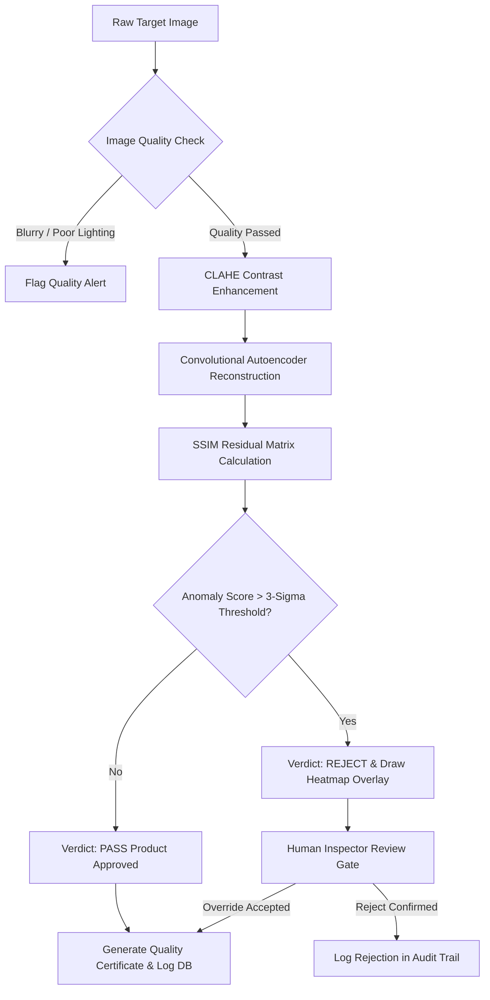
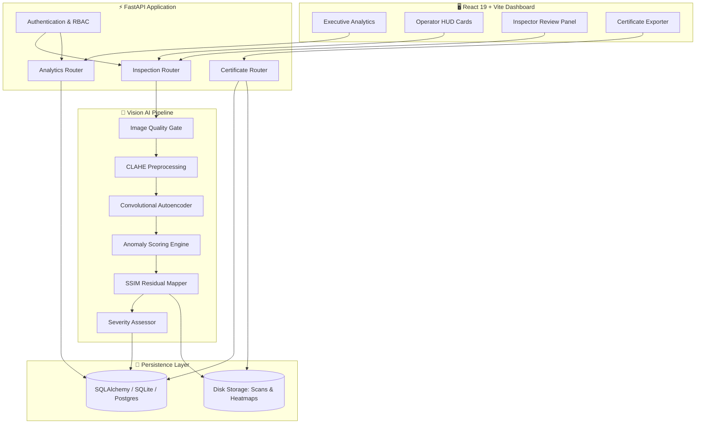

# 🔍 VisionInspect AI

> **AI-powered visual quality inspection that learns what "normal" looks like - then finds what's wrong.**

VisionInspect AI uses Convolutional Autoencoders and SSIM-based residual mapping to detect, score, and visualize manufacturing defects across 15 industrial product categories without requiring defective training samples.

[](https://www.python.org/)
[](https://fastapi.tiangolo.com/)
[](https://react.dev/)
[](https://tailwindcss.com/)
[](https://pytorch.org/)
[](https://www.docker.com/)

---

<p align="center">
  
</p>

<p align="center">
  
</p>

---

### ⚡ At a Glance

| Capability | VisionInspect AI Implementation |
|---|---|
| 🧠 **Detection** | Unsupervised Autoencoder Anomaly Detection |
| 🔬 **Localization** | SSIM Residual Heatmaps + Spatial Bounding Boxes |
| ⚡ **Performance** | Low-latency inference pipeline optimized for CPU deployment |
| 🏭 **Coverage** | 15 Industrial Product Categories (MVTec AD Benchmark) |
| 👁️ **Human Review** | Human-in-the-Loop Inspector Decision Overrides |
| 📊 **Analytics** | Real-Time Executive Dashboard + Operator HUD Telemetry |
| 📜 **Traceability** | Persistent Audit Logs + Printable Quality Certificates |
| 🐳 **Deployment** | Docker & Docker Compose Containerized Orchestration |
| 🔌 **API Interface** | RESTful FastAPI Service with Interactive Swagger Docs |

---

## 📋 Table of Contents

- [Overview](#-overview)
- [Why VisionInspect AI](#-why-visioninspect-ai)
- [Product Walkthrough](#️-product-walkthrough)
- [How It Works](#-how-it-works)
- [Key Features](#-key-features)
- [System Architecture](#%EF%B8%8F-system-architecture)
- [Performance & Evaluation](#-performance--evaluation)
- [Engineering Decisions](#-engineering-decisions)
- [Repository Structure](#-repository-structure)
- [Tech Stack](#%EF%B8%8F-tech-stack)
- [Database Schema](#-database-schema)
- [API Reference](#-api-reference)
- [Quick Start & Deployment](#-quick-start--deployment)
- [Testing & Validation](#-testing--validation)
- [Limitations & Roadmap](#%EF%B8%8F-limitations--roadmap)
- [License](#-license)

---

## 🔍 Overview

In high-speed manufacturing environments, traditional visual quality control relies heavily on manual human inspection—a process that is labor-intensive, subjective, slow, and susceptible to fatigue. 

**VisionInspect AI** automates visual quality assurance by deploying **Convolutional Autoencoders (CAE)** trained exclusively on defect-free (normal) product images. By comparing target assembly scans against latent spatial reconstructions, the system generates pixel-wise **SSIM residual heatmaps**, calculates continuous anomaly scores, determines pass/fail verdicts, and issues compliance certificates—delivering an auditable inspection pipeline built for CPU execution.

---

## 🚀 Why VisionInspect AI?

Most visual inspection projects follow a basic linear pattern:
$$\text{Image} \longrightarrow \text{Model} \longrightarrow \text{Prediction}$$

VisionInspect AI delivers an end-to-end operational inspection pipeline:
$$\text{Image} \longrightarrow \text{Quality Gate} \longrightarrow \text{Reconstruction} \longrightarrow \text{Anomaly Score} \longrightarrow \text{Localization} \longrightarrow \text{Severity} \longrightarrow \text{Human Review} \longrightarrow \text{Audit Trail} \longrightarrow \text{Analytics}$$

### Key Differentiators

* 🧠 **Zero Defect Dataset Needed**: Models normal product features exclusively, eliminating the need to collect thousands of rare defect samples.
* 🔬 **Pixel-Wise Defect Localization**: Highlights exact spatial anomaly locations using SSIM residual heatmaps rather than simple binary flags.
* 👁️ **Human-in-the-Loop Control**: Authorized quality engineers can review borderline AI decisions and execute manual overrides with database audit logging.
* 📜 **Automated Traceability**: Generates downloadable PDF Quality Certificates for every passed or overridden inspection run.
* 📊 **Multi-Role Visibility**: Provides specialized interface views, from high-level Executive Dashboards to operational HUD Telemetry cards.
* 🐳 **Containerized Architecture**: Production-oriented setup using Docker Compose rather than isolated notebook scripts.

---

## 🖥️ Product Walkthrough

### 🔍 AI Inspection & Heatmap Overlay
<p align="center">
  
</p>

### 🔥 Defect Localization & SSIM Analysis
<p align="center">
  
</p>

### 📊 Executive Analytics & Trends
<p align="center">
  
</p>

### 👁️ Inspector Decision Overrides
<p align="center">
  
</p>

---

## 🧠 How It Works



## ✨ Key Features

- 🧠 **Unsupervised Anomaly Engine**: PyTorch Convolutional Autoencoders capture spatial norms across 15 product categories without requiring labeled defect data.

- 🗺️ **SSIM Residual Heatmaps**: Generates color-coded pixel-wise anomaly heatmaps and bounding boxes highlighting structural deviations.

- 📊 **Executive Dashboard**: Interactive Recharts analytics tracking 30-day failure trends, category defect frequencies, and yield rates.

- ⚡ **HUD Telemetry Cards**: Heads-Up Display metric cards providing line operators with category health indicators and real-time alert triggers.

- ⚖️ **Decision Override Control**: Human-in-the-loop pipeline allowing quality engineers to adjust edge-case verdicts with persistent database records.

- 📜 **Printable Quality Certificates**: Automated generation of standardized PDF quality certificates detailing SKU information, confidence scores, and defect indices.

- 🔬 **Pre-Inference Quality Validation**: Automated input validation checking for blur, underexposure, overexposure, and contrast levels before neural evaluation.

## 🏗️ System Architecture

## 📈 Performance & Evaluation

The anomaly detection pipeline was evaluated across **15 industrial categories** using calibrated **3-sigma statistical thresholds** ($\mu + 3\sigma$) on normal validation distributions.

### ⚡ Benchmark Performance

| **Metric**                   | **Result**                            |
| ---------------------------- | ------------------------------------- |
| Target Hardware              | **Intel i7 CPU / Standard Edge Node** |
| Median Inference Latency     | **~85 ms**                            |
| Image Resolution             | **128 × 128 / 256 × 256**             |
| Product Categories Evaluated | **15 Categories**                     |
| Calibrated Specificity       | **>95% (False Rejection <5%)**        |

## 🏗️ Engineering Decisions

### Why Autoencoders?

Defective product samples are rare, unpredictable, and expensive to collect in industrial settings. Modeling the structural distribution of **normal products** allows the system to flag deviations from normal geometry without requiring prior exposure to specific defect types.

### Why SSIM over MSE?

Mean Squared Error (MSE) measures absolute pixel differences, making it sensitive to global lighting fluctuations and minor alignment shifts. **Structural Similarity (SSIM)** evaluates luminance, contrast, and structural degradation, making it better suited for identifying localized visual defects.

### Why FastAPI?

FastAPI provides asynchronous request handling, native Pydantic data validation, automatic OpenAPI (Swagger) documentation, and lightweight execution overhead suitable for edge hardware.

### Why React 19 + Vite?

The frontend requires frequent state updates, real-time telemetry rendering, dynamic canvas slider comparisons, and responsive chart updates. **React 19 + Vite** provides a fast, modern SPA architecture well suited to these requirements.

## 📁 Repository Structure
```
VisionInspectAI/
├── backend/
│   ├── app/
│   │   ├── api/             # FastAPI REST endpoints & auth routes
│   │   ├── core/            # Security & configuration
│   │   ├── models/          # SQLAlchemy ORM models
│   │   └── utils/           # Image processors & certificate engine
│   ├── models/trained/      # Pre-trained Autoencoder feature matrices (.npy / .pth)
│   ├── storage/             # Staged raw scans & generated heatmaps
│   ├── main.py              # Application entrypoint & CORS middleware
│   ├── requirements.txt     # Python dependencies
│   └── Dockerfile           # Backend container definition
├── frontend/
│   ├── public/              # Static assets
│   ├── src/
│   │   ├── AllInspectionPanel.jsx   # Master inspection execution UI
│   │   ├── FactoryTelemetryCharts.jsx # Recharts analytics view
│   │   ├── LandingPage.jsx          # Entrypoint landing page
│   │   ├── RoleViews.jsx            # HUD Telemetry & Role-based views
│   │   └── App.jsx                  # Main routing & state provider
│   ├── package.json         # Node dependencies
│   └── vite.config.js       # Vite configuration
├── docs/assets/             # README screenshots & demo media
├── docker-compose.yml       # Multi-container orchestration
├── owner.txt                # Project ownership manifest
├── test_e2e.py              # End-to-end integration test suite
└── README.md                # Technical documentation
```
## 🛠️ Tech Stack

### Backend Processing

- **Language & Framework:** Python 3.10+, FastAPI
- **Database & ORM:** SQLAlchemy (SQLite / PostgreSQL)
- **ML & Vision Engine:** PyTorch, OpenCV, NumPy, Pillow, scikit-image
- **Server Execution:** Uvicorn

### Frontend Experience

- **Core Framework:** React 19 + Vite
- **Styling & Motion:** Tailwind CSS v4, Framer Motion, Lucide Icons
- **Data Visualization:** Recharts
- **Networking:** Axios API Client

### DevOps & Automation

- **Containerization:** Docker, Docker Compose
- **Testing:** Python `unittest` / `test_e2e.py`

## 📂 Database Schema

### `users`

| **Column**        | **Type** | **Constraints / Description**             |
| ----------------- | -------- | ----------------------------------------- |
| `id`              | Integer  | Primary Key (Auto-increment)              |
| `username`        | String   | Unique username index                     |
| `email`           | String   | Unique user email                         |
| `hashed_password` | String   | Encrypted password string                 |
| `role`            | Enum     | `ADMIN`, `OPERATOR`, `INSPECTOR`, `OWNER` |
| `is_active`       | Boolean  | Active status flag (Default: `True`)      |
| `created_at`      | DateTime | UTC Timestamp                             |

### `products`

| **Column**   | **Type** | **Constraints / Description**                          |
| ------------ | -------- | ------------------------------------------------------ |
| `id`         | Integer  | Primary Key (Auto-increment)                           |
| `sku`        | String   | Unique product identifier (`MVI-GRID-2026`)            |
| `name`       | String   | Human-readable product label                           |
| `category`   | String   | Industrial component category (`GRID`, `BOTTLE`, etc.) |
| `created_at` | DateTime | UTC Timestamp                                          |

### `inspection_records`

| **Column**               | **Type** | **Constraints / Description**                      |
| ------------------------ | -------- | -------------------------------------------------- |
| `id`                     | Integer  | Primary Key (Auto-increment)                       |
| `inspection_id`          | String   | Unique run identifier (`INS-YYYYMMDD_HHMMSS`)      |
| `product_id`             | Integer  | Foreign Key referencing `products.id`              |
| `product_sku`            | String   | Target SKU code                                    |
| `raw_image_path`         | String   | Storage location of raw target frame               |
| `heatmap_image_path`     | String   | Storage location of SSIM heatmap overlay           |
| `pass_fail_decision`     | String   | Final decision (`PASS`, `FAIL`, `OVERRIDDEN_PASS`) |
| `is_defective`           | Boolean  | Binary anomaly classification                      |
| `defect_type`            | String   | Identified anomaly type (`Scratch`, `Deformation`) |
| `severity_level`         | Enum     | `NONE`, `LOW`, `MEDIUM`, `HIGH`, `CRITICAL`        |
| `overall_severity_score` | Float    | Calculated anomaly reconstruction deviation        |
| `confidence_score`       | Float    | Statistical model confidence percentage            |
| `latency_ms`             | Float    | Total inference processing time in milliseconds    |
| `created_at`             | DateTime | UTC Timestamp                                      |

---

## 📡 API Reference

### Inspection & Operations

| **Method** | **Endpoint**                            | **Description**                                                               |
| ---------- | --------------------------------------- | ----------------------------------------------------------------------------- |
| `POST`     | `/inspect`                              | Runs single-frame AE analysis, generates heatmap overlays, and logs metadata. |
| `POST`     | `/batch-inspect`                        | Batch process multi-file inspection runs.                                     |
| `GET`      | `/inspections`                          | Paginated retrieval of historical inspection records.                         |
| `GET`      | `/inspections/{inspection_id}`          | Retrieves execution log and heatmaps by inspection ID.                        |
| `POST`     | `/inspections/{inspection_id}/override` | Appends inspector decision override to an existing record.                    |
| `GET`      | `/products`                             | Retrieves registered product SKUs and categories.                             |

### Executive Analytics & Telemetry

| **Method** | **Endpoint**                       | **Description**                                                          |
| ---------- | ---------------------------------- | ------------------------------------------------------------------------ |
| `GET`      | `/analytics/summary`               | Returns total counts, pass/fail ratios, average confidence, and latency. |
| `GET`      | `/analytics/defect-trends`         | 30-day temporal breakdown of pass, fail, and defect rates.               |
| `GET`      | `/analytics/severity-distribution` | Categorical inspection volume across severity tiers.                     |
| `GET`      | `/analytics/category-telemetry`    | Category-specific metrics designed for HUD Telemetry cards.              |
| `GET`      | `/analytics/recent-inspections`    | Latest 10 detailed execution logs.                                       |

---

## ⚡ Quick Start & Deployment

### Option 1: Docker Compose Deployment (Recommended)

Run the full application stack using Docker Compose:

```bash
# 1. Clone repository
git clone https://github.com/GKSJ-Deepvision/VisionInspectAI.git
cd VisionInspectAI

# 2. Build and launch services
docker-compose up --build
```
### Option 2: Local Development Setup

#### Prerequisites

- **Python:** 3.10+
- **Node.js:** v18+

#### 1. Backend Setup

```bash
cd backend

# Create virtual environment
python -m venv venv

# Windows
venv\Scripts\activate

# Linux/macOS
source venv/bin/activate

# Install dependencies
pip install -r requirements.txt

# Start FastAPI development server
uvicorn main:app --reload --port 8000
```
#### 2. Frontend Setup
```bash
cd frontend

# Install dependencies
npm install

# Start Vite development server
npm run dev --force
```
The application will be available at:

- Frontend: http://localhost:5173
- Backend API: http://localhost:8000
- Swagger API Docs: http://localhost:8000/docs

## 🧪 Testing & Validation

The repository includes an end-to-end integration suite to verify API endpoints, database state changes, and pipeline execution.

### Run End-to-End Test Suite

```bash
# Run End-to-End Test Suite
python test_e2e.py
```
## 📜 License

This project is licensed under the **MIT License**.

See the [`LICENSE`](LICENSE) file for full license details.
